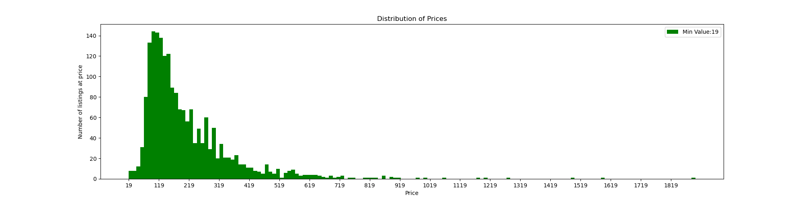

# Criminals Among Us – A Study Into White Collar Crime In Asheville, NC

<p align="center">
  
</p>

## Analyzing Publicly Available AirBNB Listings To Determine Home Owners Violating A City Ordnance

*Capstone I Project for Galvanize Data Analytics Immersive, Week 5*

*by Joanna Vasquez*

# Background

Asheville NC is a beautiful wooded region in North Carolina which borders Tennessee. It is known for it's attractive landscapes, laid back vibe, and as a launching pad for the myriad of tourist attractions in the region. In 2021, Asheville was ranked among the top location to visit in North Carolina based on TripAdvisor recommendations. With this high number of visitors, Asheville rental properties are in demand for short term rental stays, limiting the number of long-term rentals which are available for locals. In 2018, as an attempt to curb  a housing shortage for residents, the city of Asheville banned whole-house short term rentals for less than 30 days. However, as of mid-October 2021, AirBnB, a web-based provider for short-term rentals had over 1900 of these listings for Asheville, NC.

  <p align="center">
  <h align='center'> Geographic Layout For AirBnB in Asheville- October 2021</h>
  </p>
  <p align='center'>
  
</p>

# Data Overview
Airbnb launched an API in 2017 for business partners, but as of 2021, is no longer allowing access to their internal data. As a result, individuals and groups have resorted to webscraping Airbnb. Among them, InsideAirbnb is an organization who has created an activist project aimed at revealing Airbnb data to the public. For this study, I used InsideAirBnb data [found here](http://insideairbnb.com/get-the-data.html) collected between 18 OCT - 19 OCT 2021 for short-term rentals listed within Asheville city limits.

The data consisted of a single CSV file with 71 columns. The columns were composed of string and integer values and ranged in category from information on hosts, reviews, listing details,and pricing to detailed future calendar availability. After identifying the superfluous columns, the data was reduced to 31 columns with the following columns being the subject of this study:

```
airbnb_data[['host_id',
    'host_name',
    'neighbourhood',
    'room_type',
    'price',
    'minimum_nights',
    'availability_30',
    'calculated_host_listings_count_entire_homes',
    'host_id',
    'gross_income_30',
    'airbnb_host_fee',
    'airbnb_profit_30',
    'bedrooms',
    'bathrooms',
    'bathrooms_text',
    'cleaning_fee',
    'percentage_occupied',
    'net_income_30',
    'cleaners_fee_30']]
```

# Exploratory Data Analysis
The data revealed the following:

*     2563 rental listings
*     1642 unique hosts offering rentals
*     1958 listings, equal to 43% of the available rentals, for the explicitly banned whole-house short-term
      rentals:

<p align="center">
  
  
</p>

Our analysis will focus on understanding the home owners listing the banned properties, the price they are charging for the properties and the income they are gaining from offering these banned properties. Finally, we will take a look at the customer experience from staying at one of these properties. As it is possible that net gain from offering these banned rentals can not only be measured in financial terms but may also be measured through the joy these rentals can provide.

# Host Breakdown

AirBnB data has two ways to track the listing host: host name and host id. The host name is displayed to the guest and can be modified and non-unique. In order to main uniqueness, when a host first registers with the website, AirBnB uses an immutable, distinct 6-8 numerical host id which will be maintained for the life of the account.   I first grouped all listings by unique host ids in order to compile all listings by the same host and found the following:

  * 52% of hosts were using AirBnB to list only one home for short-term rentals, but 48% of hosts were listing multiple homes:
  <p align="center">
  
</p>

  * Most notably, several hosts were offering more than 10 listings, which could be indicative of a business. Figure 2 displays the names of the 20 hosts with the most listings and we can see that indeed, the top 4 hosts are vacation rentals or property management businesses, both in the for-profit sector:

<p align="center">
  
</p>

### Findings
  * Towns Property Management is a business offering 104 short term rentals in Asheville, a possible violation of
    the ordnance
  * 48% of AirBnB hosts are listing more than one short-term rental
  * The amount of hosts and the amount of multiple listings per host suggest that city restrictions may not be strictly enforced in Asheville


# Nightly Prices

Nightly Prices as advertised on AirBnB are the base price the guest will pay. Cleaning fees per stay or per number of days in stay in addition to AirBnB's service fee of 14% are added to the nightly price and are the full value the guest will pay.

Because this study focues on income for the host and airbnb, the base nightly price is used for this analysis with the understanding of the additional costs.

Distribution analysis revealed some outliers in the data but a concentration of prices clustered between 95- 200 USD, with the median value of a single night's stay at 161 USD :

<p align="center">
  
</p>

A histogram representation of the prices more clearly shows the concentration of prices in the 120-220 USD a night price:
<p align="center">
  
</p>


A breakdown of the 20 most occuring prices shows the mode of 125 USD but includes the range between 93-220 USD as being the frequently most seen prices:
<p align="center">
  
</p>


# Income
There are three elements that profit from AirBnB bookings:
* Hosts
* AirBnB
* Cleaners :  Since 2020, AirBnB mandates a strict cleaning process for each home

### Hosts

AirBnB data includes a calendar availability column which reflects the number of days available in the next 30 days as of the date of the data. This information can serve to attempt to provide a glimpse into the real income a host can expect for the next 30 days, with the understanding that these numbers can be skewed to minimal values as the number of bookings may increase in that time period.

Hosts Net Income Formula:
```
    Nightly Price * Nights Booked - ( 3% AirBnB Fee + Cleaning Fee * Nightly Bookings For Next 30 Days / Minimum Night Stay
```
<p align="center">
  
</p>

Due to the outliers of 38 and 46,414 USD the median of 3,264 USD is the best representation of the average real income gain for Asheville hosts:


### AirBnB

AirBnB profits in two ways, charging both the host and the guest:
* 3% of Hosts Gross Income per booking is charged to hosts
* 14% of Hosts Gross Income per booking is charged to guests

AirBnB Income Formula:
```
17% * Hosts Gross Income
```
On average, AirBnB profited 733 USD per listing in Asheville
<p align="center">
  
</p>


### Cleaners

The AirBnB data does not contain statistics on total guest charge or cleaners fee per listing. A cleaners fee was determined using a theoretical number of $75 per 1BDR/1BA and  incrementing by 25 for extra bedroom and incrementing by 50 for both an extra bedroom and bath.

Further, the data does not maintain a figure on the amount of bookings in the next 30 days, as a cleaning fee is charged per booking, the frequency of cleaning per limiting was determined by dividing the booked nights by the minimum  number of nights

Cleaners Income Formula:
```
 Cleaning Fee Adjusted to number of BDR\BA  *  (Booked Nights \ Minimum Nights)
```


<p align="center">
  
</p>


### Total Profits

The total monthly profits amounts to  millions of dollars, clearly showing the high profit margin for certain elements in Asheville.

<p align="center">
  
</p>


# Future Steps

* Compare nightly prices to local legal hotel prices to determine the competition AirBnB illegal stays poses to the local hotel industry

* Using an external source for aggregated rental properties, compare local rental rates for like properties (bedroom, bath, location) to determine the profit margin for hosts to operate an AirBnB versus a long-term rental and to determine whether AirBnB with its additional fees is a viable option for Asheville residents

* Upload Asheville zoning districts and geographically place listings within Asheville zoning district to more accurately determine legality of listing

* Identify profile urls for hosts found to be conducting illegal activity for possible reporting to AirBnB


<p align="center">
  
</p>


# References

http://insideairbnb.com/asheville/?neighbourhood=&filterEntireHomes=false&filterHighlyAvailable=false&filterRecentReviews=false&filterMultiListings=false#

https://www.ashevillenc.gov/service/apply-for-a-homestay-permit/

https://data-avl.opendata.arcgis.com/datasets/c22b353722b14d02bb06b23cd1bedf60_9/explore?filters=eyJ6b25pbmciOlsiQ0JEIl0sInBlcmltZXRlciI6WzQ0Ny42NDExLDE1Mjk0Ni44XX0%3D&location=35.538885%2C-82.564500%2C12.00

https://mountainx.com/news/asheville-struggles-to-rein-in-illegal-short-term-rentals/

https://www.airbnb.com/resources/hosting-homes/a/how-much-does-airbnb-charge-hosts-288

https://www.carolinajournal.com/news-article/raleigh-moves-forward-with-asheville-like-airbnb-regulations/
